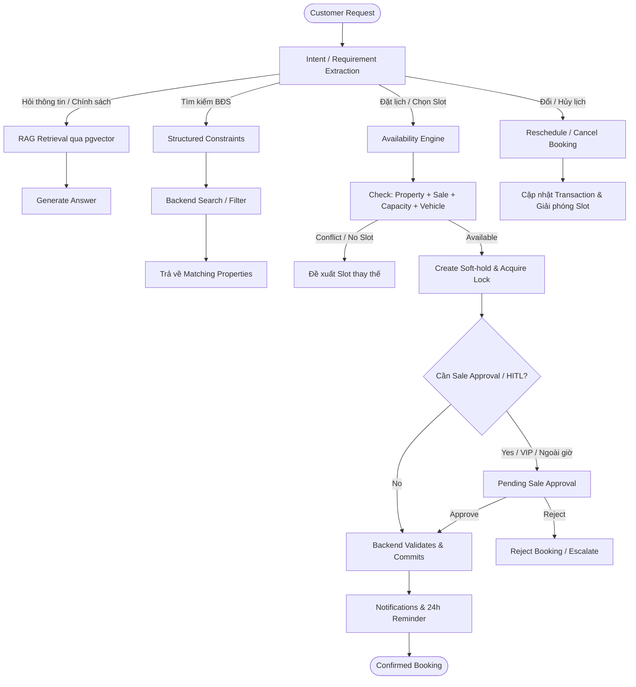

# Agent Flow Diagram

```mermaid
graph TD
    UQ([Customer Request])
    
    IR[Intent / Requirement Extraction]
    
    UQ --> IR
    
    IR -- Hỏi thông tin / Chính sách --> RAG[RAG Retrieval qua pgvector]
    RAG --> GA[Generate Answer]
    
    IR -- Tìm kiếm BĐS --> SC[Structured Constraints]
    SC --> BS[Backend Search / Filter]
    BS --> MP[Trả về Matching Properties]
    
    IR -- Đặt lịch / Chọn Slot --> AE[Availability Engine]
    
    AE --> CA[Check: Property + Sale + Capacity + Vehicle]
    CA -- Conflict / No Slot --> CF[Đề xuất Slot thay thế]
    CA -- Available --> SH[Create Soft-hold & Acquire Lock]
    
    SH --> HITL{Cần Sale Approval / HITL?}
    HITL -- Yes / VIP / Ngoài giờ --> PA[Pending Sale Approval]
    HITL -- No --> CB[Backend Validates & Commits]
    
    PA -- Approve --> CB
    PA -- Reject --> RJ[Reject Booking / Escalate]
    
    CB --> NOTIF[Notifications & 24h Reminder]
    NOTIF --> FIN([Confirmed Booking])
    
    IR -- Đổi / Hủy lịch --> RC[Reschedule / Cancel Booking]
    RC --> UPD[Cập nhật Transaction & Giải phóng Slot]
```