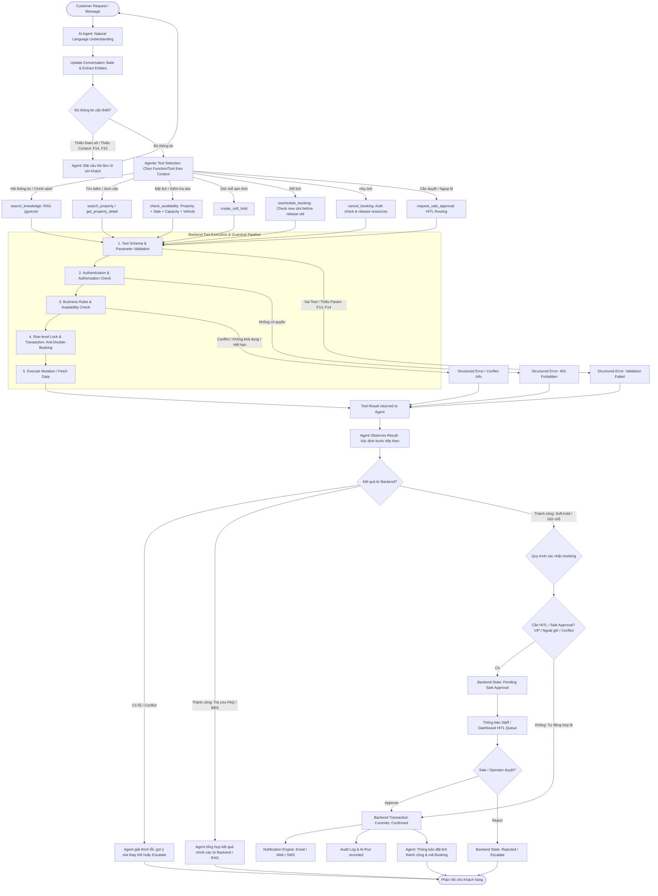

# Agent Flow Diagram

```mermaid
graph TD
    %% 1. User & Intent Stage
    CR([Customer Request / Message]) --> INTENT[AI Agent: Natural Language Understanding]
    INTENT --> STATE[Update Conversation State & Extract Entities]
    
    %% Missing Info Check
    STATE --> CHK_INFO{Đủ thông tin cần thiết?}
    CHK_INFO -- Thiếu tham số / Thiếu Context: F14, F15 --> ASK[Agent: Đặt câu hỏi làm rõ với Khách]
    ASK --> CR
    
    %% Tool Selection (Agentic Loop)
    CHK_INFO -- Đủ thông tin --> SELECT_TOOL[Agentic Tool Selection: Chọn Function/Tool theo Context]
    
    %% Branches of Tool Calling
    SELECT_TOOL -- Hỏi thông tin / Chính sách --> T_KNOW[search_knowledge: RAG pgvector]
    SELECT_TOOL -- Tìm kiếm / Xem căn --> T_SEARCH[search_property / get_property_detail]
    SELECT_TOOL -- Đặt lịch / Kiểm tra slot --> T_AVAIL[check_availability: Property + Sale + Capacity + Vehicle]
    SELECT_TOOL -- Giữ chỗ tạm thời --> T_HOLD[create_soft_hold]
    SELECT_TOOL -- Đổi lịch --> T_RESCHED[reschedule_booking: Check new slot before release old]
    SELECT_TOOL -- Hủy lịch --> T_CANCEL[cancel_booking: Auth check & release resources]
    SELECT_TOOL -- Cần duyệt / Ngoại lệ --> T_APPROVAL[request_sale_approval: HITL Routing]

    %% 2. Backend Validation & Execution Pipeline (Source of Truth)
    subgraph BackendPipeline["Backend Tool Execution & Guardrail Pipeline"]
        VAL_SCHEMA[1. Tool Schema & Parameter Validation]
        VAL_AUTH[2. Authentication & Authorization Check]
        VAL_BIZ[3. Business Rules & Availability Check]
        TX_LOCK[4. Row-level Lock & Transaction: Anti-Double-Booking]
        EXEC_OP[5. Execute Mutation / Fetch Data]
    end

    T_KNOW --> VAL_SCHEMA
    T_SEARCH --> VAL_SCHEMA
    T_AVAIL --> VAL_SCHEMA
    T_HOLD --> VAL_SCHEMA
    T_RESCHED --> VAL_SCHEMA
    T_CANCEL --> VAL_SCHEMA
    T_APPROVAL --> VAL_SCHEMA

    VAL_SCHEMA --> VAL_AUTH
    VAL_AUTH --> VAL_BIZ
    VAL_BIZ --> TX_LOCK
    TX_LOCK --> EXEC_OP

    %% 3. Outcome & Fail-safe Handling
    VAL_BIZ -- Conflict / Không khả dụng / Hết hạn --> ERR_BIZ[Structured Error / Conflict Info]
    VAL_AUTH -- Không có quyền --> ERR_AUTH[Structured Error: 403 Forbidden]
    VAL_SCHEMA -- Sai Tool / Thiếu Param: F13, F14 --> ERR_SCHEMA[Structured Error: Validation Failed]

    ERR_BIZ --> TOOL_RES[Tool Result returned to Agent]
    ERR_AUTH --> TOOL_RES
    ERR_SCHEMA --> TOOL_RES
    EXEC_OP --> TOOL_RES

    %% 4. Agent Observation & Confirmation Rule
    TOOL_RES --> OBSERVE[Agent Observes Result: Xác định bước tiếp theo]
    
    OBSERVE --> CHECK_RES{Kết quả từ Backend?}
    
    CHECK_RES -- Có lỗi / Conflict --> HANDLE_ERR[Agent giải thích lỗi, gợi ý slot thay thế hoặc Escalate]
    HANDLE_ERR --> RESP([Phản hồi cho Khách hàng])

    CHECK_RES -- Thành công: Tra cứu FAQ / BĐS --> GEN_ANS[Agent tổng hợp kết quả chính xác từ Backend / RAG]
    GEN_ANS --> RESP

    CHECK_RES -- Thành công: Soft-hold / Giữ chỗ --> CHK_CONFIRM{Quy trình xác nhận booking}
    
    %% Confirmation Rule: Agent CANNOT commit Confirmed directly!
    CHK_CONFIRM --> HITL_CHECK{Cần HITL / Sale Approval? VIP / Ngoài giờ / Conflict}
    HITL_CHECK -- Có --> PENDING[Backend State: Pending Sale Approval]
    PENDING --> NOTIF_SALE[Thông báo Staff / Dashboard HITL Queue]
    NOTIF_SALE --> SALE_DECISION{Sale / Operator duyệt?}
    SALE_DECISION -- Approve --> COMMIT_CONFIRMED[Backend Transaction Commits: Confirmed]
    SALE_DECISION -- Reject --> COMMIT_REJECT[Backend State: Rejected / Escalate]
    
    HITL_CHECK -- Không: Tự động hợp lệ --> COMMIT_CONFIRMED

    COMMIT_CONFIRMED --> EMIT_NOTIF[Notification Engine: Email / Web / SMS]
    COMMIT_CONFIRMED --> AUDIT_LOG[Audit Log & AI Run recorded]
    
    %% Prevent F16: Only announce confirmed AFTER Backend commits
    COMMIT_CONFIRMED --> AGENT_ANNOUNCE[Agent: Thông báo đặt lịch thành công & mã Booking]
    AGENT_ANNOUNCE --> RESP
    COMMIT_REJECT --> RESP
```