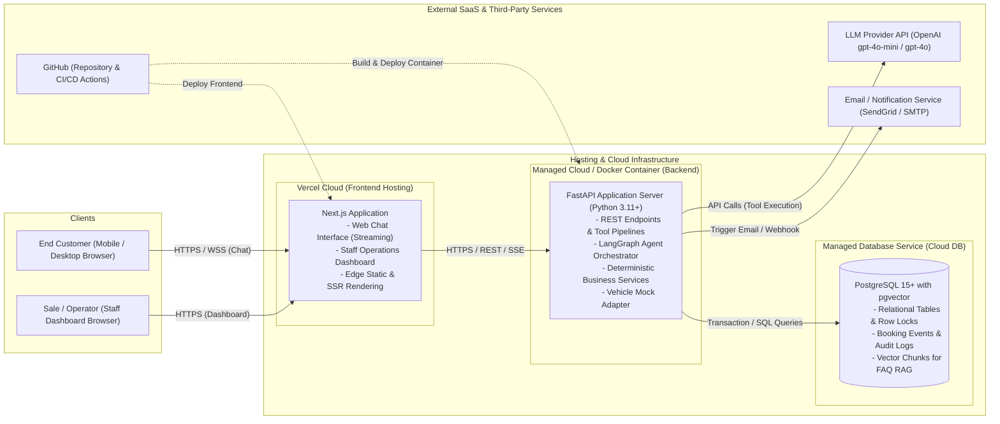

# Deployment Diagram

```mermaid
graph LR
    subgraph Clients["Clients"]
        C_BROWSER["End Customer (Mobile / Desktop Browser)"]
        S_BROWSER["Sale / Operator (Staff Dashboard Browser)"]
    end

    subgraph ExternalCloud["External SaaS & Third-Party Services"]
        GH["GitHub (Repository & CI/CD Actions)"]
        LLM_API["LLM Provider API (OpenAI gpt-4o-mini / gpt-4o)"]
        SMTP_API["Email / Notification Service (SendGrid / SMTP)"]
    end

    subgraph HostingInfrastructure["Hosting & Cloud Infrastructure"]
        subgraph VercelEdge["Vercel Cloud (Frontend Hosting)"]
            NEXT_APP["Next.js Application
            - Web Chat Interface (Streaming)
            - Staff Operations Dashboard
            - Edge Static & SSR Rendering"]
        end

        subgraph ContainerHosting["Managed Cloud / Docker Container (Backend)"]
            FAST_APP["FastAPI Application Server (Python 3.11+)
            - REST Endpoints & Tool Pipelines
            - LangGraph Agent Orchestrator
            - Deterministic Business Services
            - Vehicle Mock Adapter"]
        end

        subgraph ManagedData["Managed Database Service (Cloud DB)"]
            PG_DB[("PostgreSQL 15+ with pgvector
            - Relational Tables & Row Locks
            - Booking Events & Audit Logs
            - Vector Chunks for FAQ RAG")]
        end
    end

    %% Client Connections
    C_BROWSER -- "HTTPS / WSS (Chat)" --> NEXT_APP
    S_BROWSER -- "HTTPS (Dashboard)" --> NEXT_APP

    %% Frontend to Backend
    NEXT_APP -- "HTTPS / REST / SSE" --> FAST_APP

    %% Backend to External
    FAST_APP -- "API Calls (Tool Execution)" --> LLM_API
    FAST_APP -- "Transaction / SQL Queries" --> PG_DB
    FAST_APP -- "Trigger Email / Webhook" --> SMTP_API

    %% CI / CD
    GH -. "Deploy Frontend" .-> NEXT_APP
    GH -. "Build & Deploy Container" .-> ContainerHosting
```