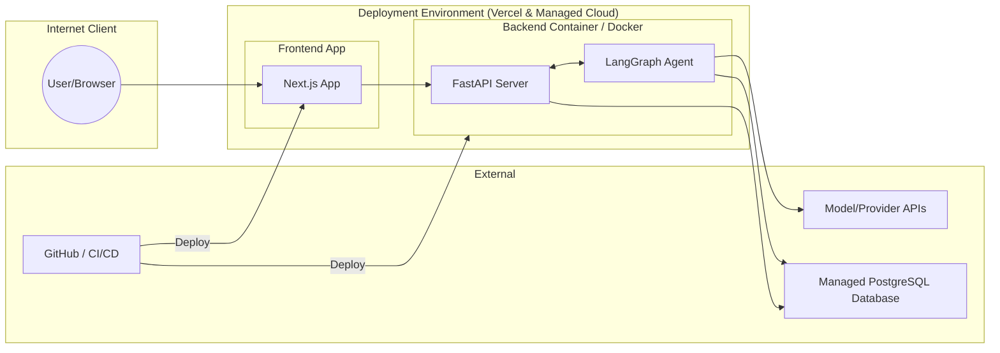

# Deployment Diagram

```mermaid
graph LR
    subgraph External["External"]
        GH[GitHub / CI/CD]
        LLM[Model/Provider APIs]
        MDB[Managed PostgreSQL Database]
    end

    subgraph Internet["Internet Client"]
        USR((User/Browser))
    end

    subgraph DeploymentEnv["Deployment Environment (Vercel & Managed Cloud)"]
        subgraph VercelApp["Frontend App"]
            NEXT[Next.js App]
        end
        
        subgraph CloudContainer["Backend Container / Docker"]
            FAST[FastAPI Server]
            LANG[LangGraph Agent]
        end
    end

    USR --> NEXT
    NEXT --> FAST
    FAST <--> LANG
    
    LANG --> LLM
    FAST --> MDB
    LANG --> MDB
    
    GH -- Deploy --> NEXT
    GH -- Deploy --> CloudContainer
```