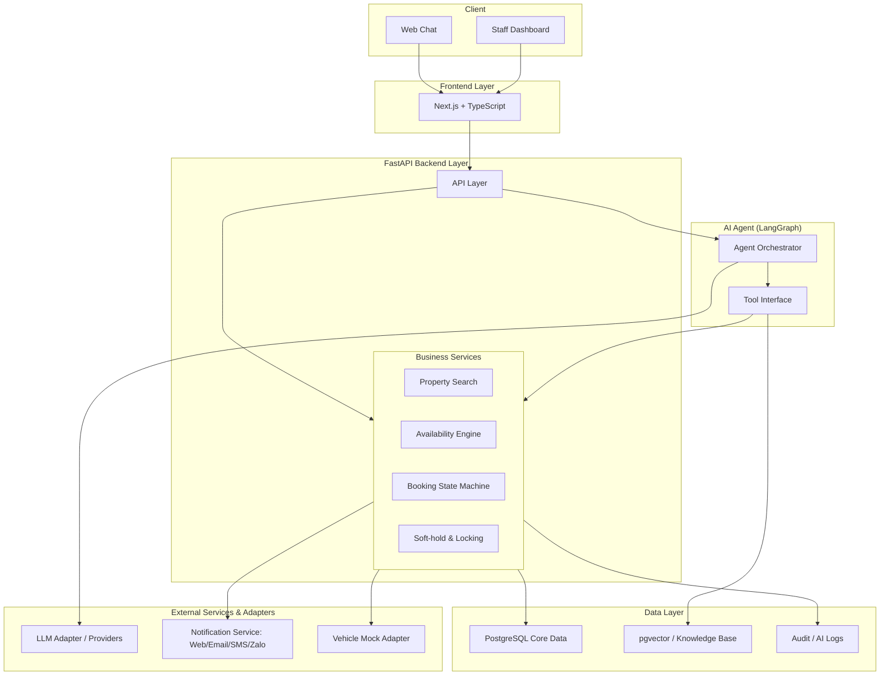

# System Overview Diagram

```mermaid
graph TD
    subgraph Client["Client"]
        WC[Web Chat]
        SD[Staff Dashboard]
    end

    subgraph Frontend["Frontend Layer"]
        NJ[Next.js + TypeScript]
    end

    subgraph Backend["FastAPI Backend Layer"]
        API[API Layer]
        subgraph BusinessServices["Business Services"]
            PS[Property Search]
            AE[Availability Engine]
            BSM[Booking State Machine]
            SH[Soft-hold & Locking]
        end
    end

    subgraph Agent["AI Agent (LangGraph)"]
        AO[Agent Orchestrator]
        TI[Tool Interface]
    end

    subgraph DataLayer["Data Layer"]
        PG[PostgreSQL Core Data]
        PGV[pgvector / Knowledge Base]
        AL[Audit / AI Logs]
    end

    subgraph External["External Services & Adapters"]
        LLM[LLM Adapter / Providers]
        NOTIF[Notification Service: Web/Email/SMS/Zalo]
        VEHICLE[Vehicle Mock Adapter]
    end

    WC --> NJ
    SD --> NJ
    NJ --> API
    API --> AO
    API --> BusinessServices
    AO --> TI
    TI --> BusinessServices
    BusinessServices --> PG
    TI --> PGV
    AO --> LLM
    BusinessServices --> NOTIF
    BusinessServices --> VEHICLE
    BusinessServices --> AL
```