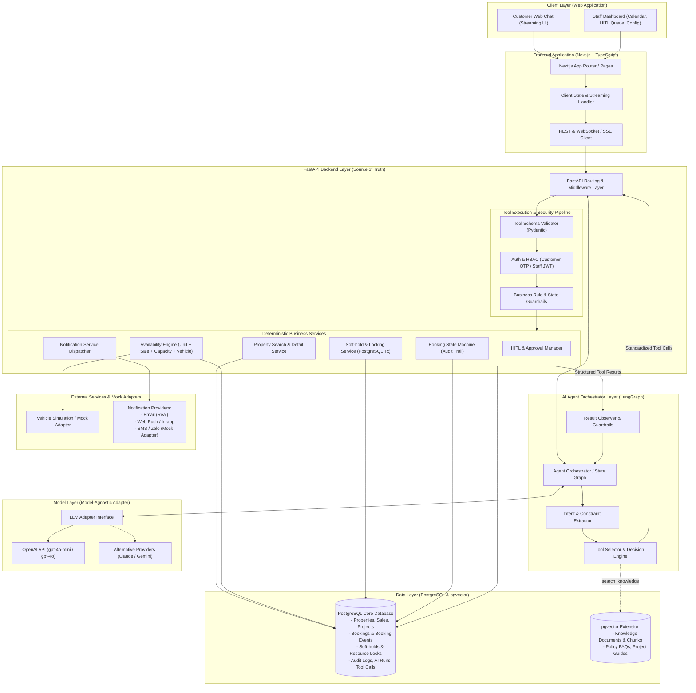

# System Overview Diagram

```mermaid
graph TD
    %% Clients
    subgraph ClientLayer["Client Layer (Web Application)"]
        WC["Customer Web Chat (Streaming UI)"]
        SD["Staff Dashboard (Calendar, HITL Queue, Config)"]
    end

    %% Frontend App
    subgraph FrontendApp["Frontend Application (Next.js + TypeScript)"]
        FE_ROUTER["Next.js App Router / Pages"]
        FE_STATE["Client State & Streaming Handler"]
        FE_API_CLIENT["REST & WebSocket / SSE Client"]
    end

    WC --> FE_ROUTER
    SD --> FE_ROUTER
    FE_ROUTER --> FE_STATE
    FE_STATE --> FE_API_CLIENT

    %% API Gateway & Backend
    FE_API_CLIENT --> FAST_API

    subgraph BackendSystem["FastAPI Backend Layer (Source of Truth)"]
        FAST_API["FastAPI Routing & Middleware Layer"]

        subgraph ToolPipeline["Tool Execution & Security Pipeline"]
            VAL_SCHEMA["Tool Schema Validator (Pydantic)"]
            AUTH_RBAC["Auth & RBAC (Customer OTP / Staff JWT)"]
            BIZ_VALIDATOR["Business Rule & State Guardrails"]
        end

        subgraph CoreServices["Deterministic Business Services"]
            SVC_SEARCH["Property Search & Detail Service"]
            SVC_AVAIL["Availability Engine (Unit + Sale + Capacity + Vehicle)"]
            SVC_HOLD["Soft-hold & Locking Service (PostgreSQL Tx)"]
            SVC_SM["Booking State Machine (Audit Trail)"]
            SVC_HITL["HITL & Approval Manager"]
            SVC_NOTIF["Notification Service Dispatcher"]
        end
    end

    FAST_API --> VAL_SCHEMA
    VAL_SCHEMA --> AUTH_RBAC
    AUTH_RBAC --> BIZ_VALIDATOR
    BIZ_VALIDATOR --> CoreServices

    %% AI Agent Orchestrator
    subgraph AgentOrchestrator["AI Agent Orchestrator Layer (LangGraph)"]
        ORCH["Agent Orchestrator / State Graph"]
        INTENT_EXT["Intent & Constraint Extractor"]
        TOOL_SEL["Tool Selector & Decision Engine"]
        RES_OBS["Result Observer & Guardrails"]
    end

    FAST_API <--> ORCH
    ORCH --> INTENT_EXT
    INTENT_EXT --> TOOL_SEL
    TOOL_SEL -- "Standardized Tool Calls" --> FAST_API
    CoreServices -- "Structured Tool Results" --> RES_OBS
    RES_OBS --> ORCH

    %% External LLM Provider
    subgraph ModelLayer["Model Layer (Model-Agnostic Adapter)"]
        LLM_ADAPTER["LLM Adapter Interface"]
        LLM_OPENAI["OpenAI API (gpt-4o-mini / gpt-4o)"]
        LLM_ALT["Alternative Providers (Claude / Gemini)"]
    end

    ORCH <--> LLM_ADAPTER
    LLM_ADAPTER --> LLM_OPENAI
    LLM_ADAPTER -.-> LLM_ALT

    %% Data Layer
    subgraph DataLayer["Data Layer (PostgreSQL & pgvector)"]
        DB_CORE[("PostgreSQL Core Database
        - Properties, Sales, Projects
        - Bookings & Booking Events
        - Soft-holds & Resource Locks
        - Audit Logs, AI Runs, Tool Calls")]
        
        DB_VECTOR[("pgvector Extension
        - Knowledge Documents & Chunks
        - Policy FAQs, Project Guides")]
    end

    CoreServices --> DB_CORE
    SVC_SEARCH --> DB_CORE
    SVC_AVAIL --> DB_CORE
    SVC_HOLD --> DB_CORE
    SVC_SM --> DB_CORE
    TOOL_SEL -. "search_knowledge" .-> DB_VECTOR

    %% External Adapters
    subgraph ExternalAdapters["External Services & Mock Adapters"]
        ADAPT_VEHICLE["Vehicle Simulation / Mock Adapter"]
        ADAPT_NOTIF["Notification Providers:
        - Email (Real)
        - Web Push / In-app
        - SMS / Zalo (Mock Adapter)"]
    end

    SVC_AVAIL --> ADAPT_VEHICLE
    SVC_NOTIF --> ADAPT_NOTIF
```